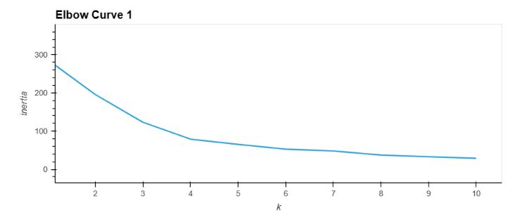
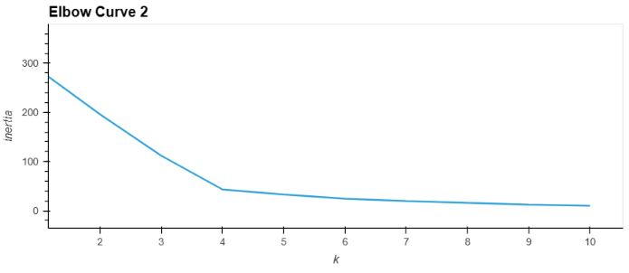
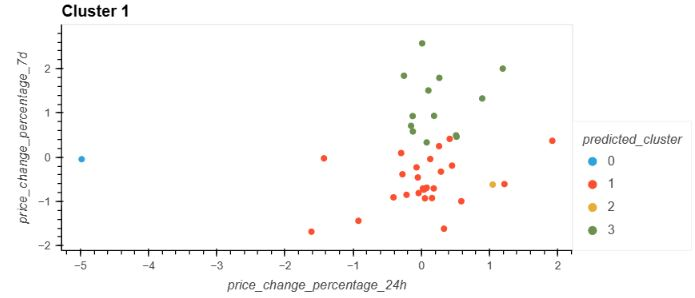
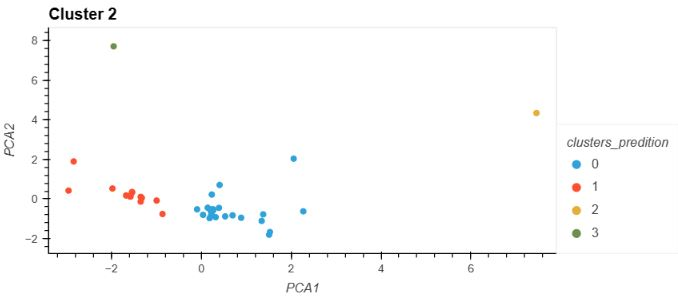

# CryptoClustering

## Introduction
Use your knowledge of Python and unsupervised learning to predict if cryptocurrencies are affected by 24-hour or 7-day price changes

## Sources of data
Within Resources Folder:
*  crypto_market_data.csv

## Findings
### Elbow Curve Comparison:

* The elbow curve for the PCA data (elbow curve 2) shows a lower inertia value compared to the elbow curve for the original data (elbow curve 1). This indicates that using fewer features resulted in a reduction in the sum of squared distances within the clusters. A lower inertia value suggests better clustering performance and tighter grouping of data points within each cluster.

### Cluster Scatter Plot Comparison:

* Cluster Graph 1 (using original data): The clusters are overlapping, and there is no clear separation or distinct clusters. This suggests that using the original data, with more features, may not have effectively captured the underlying patterns or structure of the data for clustering purposes.

* Cluster Graph 2 (using PCA data): The clusters in this graph are not overlapping, and there is a clear separation and well-defined clusters. You can identify 4 distinct clusters. This indicates that using fewer features (through PCA) has potentially reduced noise and helped reveal more distinct patterns in the data, leading to more meaningful and separable clusters.

## Conclusion

Based on these observations, it seems that using fewer features (PCA data) to cluster the cryptocurrency data using K-Means has had a positive impact. It has resulted in better-defined and separable clusters compared to using the original data. The reduction in the number of features through PCA has likely helped to highlight the essential patterns and reduce the impact of noise, leading to more accurate and meaningful clustering results.

# Project Outline

## Instructions

### Prepare the Data
Use the StandardScaler() module from scikit-learn to normalize the data from the CSV file.

Create a DataFrame with the scaled data and set the "coin_id" index from the original DataFrame as the index for the new DataFrame.

### Find the Best Value for k Using the Original Scaled DataFrame
Use the elbow method to find the best value for k using the following steps:

Create a list with the number of k values from 1 to 11.
Create an empty list to store the inertia values.
Create a for loop to compute the inertia with each possible value of k.
Create a dictionary with the data to plot the elbow curve.
Plot a line chart with all the inertia values computed with the different values of k to visually identify the optimal value for k.
Answer the following question in your notebook: What is the best value for k?

### Cluster Cryptocurrencies with K-means Using the Original Scaled Data
Use the following steps to cluster the cryptocurrencies for the best value for k on the original scaled data:

Initialize the K-means model with the best value for k.
Fit the K-means model using the original scaled DataFrame.
Predict the clusters to group the cryptocurrencies using the original scaled DataFrame.
Create a copy of the original data and add a new column with the predicted clusters.
Create a scatter plot using hvPlot as follows:
Set the x-axis as "PC1" and the y-axis as "PC2".
Color the graph points with the labels found using K-means.
Add the "coin_id" column in the hover_cols parameter to identify the cryptocurrency represented by each data point.

### Optimize Clusters with Principal Component Analysis
Using the original scaled DataFrame, perform a PCA and reduce the features to three principal components.

Retrieve the explained variance to determine how much information can be attributed to each principal component and then answer the following question in your notebook:

What is the total explained variance of the three principal components?
Create a new DataFrame with the PCA data and set the "coin_id" index from the original DataFrame as the index for the new DataFrame.

### Find the Best Value for k Using the PCA Data
Use the elbow method on the PCA data to find the best value for k using the following steps:

Create a list with the number of k-values from 1 to 11.
Create an empty list to store the inertia values.
Create a for loop to compute the inertia with each possible value of k.
Create a dictionary with the data to plot the Elbow curve.
Plot a line chart with all the inertia values computed with the different values of k to visually identify the optimal value for k.
Answer the following question in your notebook:
What is the best value for k when using the PCA data?
Does it differ from the best k value found using the original data?

### Cluster Cryptocurrencies with K-means Using the PCA Data
Use the following steps to cluster the cryptocurrencies for the best value for k on the PCA data:

Initialize the K-means model with the best value for k.
Fit the K-means model using the PCA data.
Predict the clusters to group the cryptocurrencies using the PCA data.
Create a copy of the DataFrame with the PCA data and add a new column to store the predicted clusters.
Create a scatter plot using hvPlot as follows:
Set the x-axis as "price_change_percentage_24h" and the y-axis as "price_change_percentage_7d".
Color the graph points with the labels found using K-means.
Add the "coin_id" column in the hover_cols parameter to identify the cryptocurrency represented by each data point.
